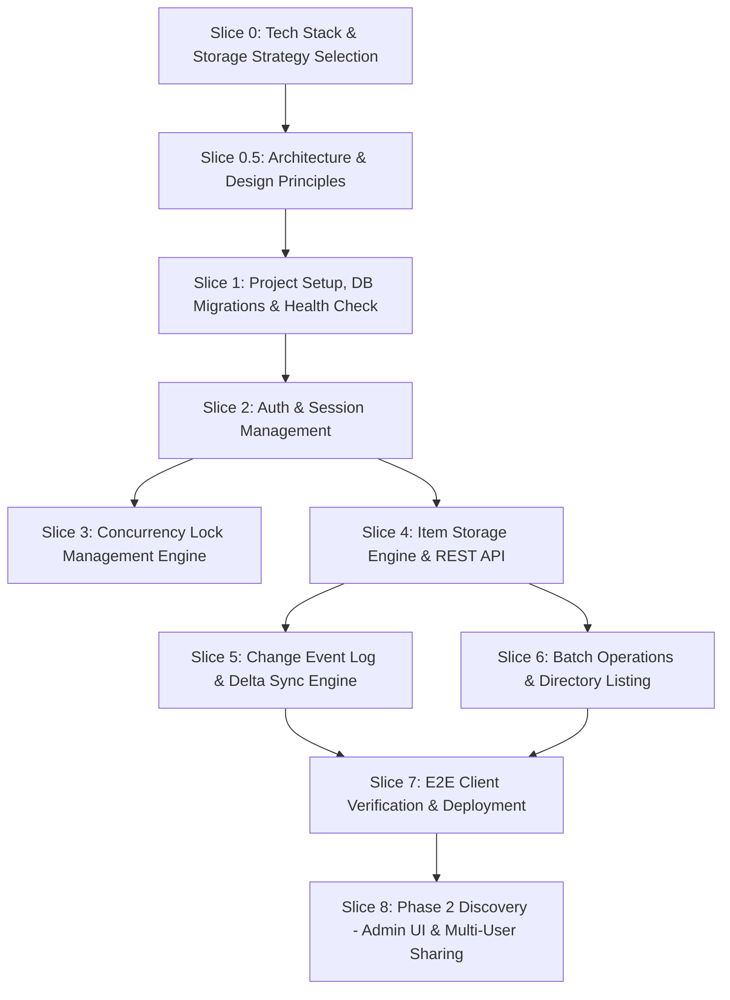

# Custom Joplin Sync Server: Foundational Plan & Handoff Playbook

This document outlines the **Foundational Plan** and **Session Handoff Playbook** for building a custom, lightweight Joplin Sync Server based on the [Joplin Server Deep Dive](file:///home/jberlyn/src/joplin-sync/joplin_server_deep_dive.md).

The project is structured into **8 self-contained Vertical Slices** (Slice 0 through Slice 7). Each slice represents a complete milestone. For each slice, a ready-to-use **Session Handoff Prompt** is provided so you can start a fresh session with Agy to first design/decide technical details, then implement and verify that slice.

---

## High-Level Slice Roadmap



---

## Detailed Slice Specifications & Handoff Prompts

### Slice 0: Tech Stack & Storage Strategy Selection

- **Goal**: Interactively evaluate language options, web frameworks, and storage driver options with Agy, resulting in an Architectural Decision Record (ADR).
- **Key Discussion Points**:
  - **Programming Language & Framework**: Compare Go (Gin/Echo), TypeScript/Node (Fastify), Rust (Axum), Python (FastAPI) across memory usage, single binary deployment, speed, and ecosystem.
  - **Storage Driver Strategy**: Compare SQLite BLOBs vs Local Disk filesystem storage vs Hybrid (Metadata in DB, Content on Disk) vs S3.
  - **Database Engine**: SQLite vs PostgreSQL.
- **Deliverables**: Architectural Decision Record (ADR) file `adr_tech_stack.md`.
- **Acceptance Criteria**: Concrete choices made for Language, Web Framework, DB Engine, and Storage Driver architecture.

#### 📋 Session Handoff Prompt (Slice 0)
```text
We are starting Slice 0 of the custom Joplin Sync Server project.
Please refer to @joplin_server_deep_dive.md and @foundation_plan.md.

Our goal for this session is to conduct an interactive tech stack and storage architecture evaluation.
Please present a comparison matrix and recommendation for:
1. Programming Language & Framework (e.g. Go, TypeScript/Node, Rust, Python) considering deployment simplicity, performance, memory footprint, and maintainability.
2. Storage Backend Driver (SQLite BLOBs vs Local Disk Filesystem vs Modular Abstraction).
3. Database Engine (SQLite vs Postgres).

Guide me through the trade-offs, ask any necessary clarifying questions, and help me decide. Once we align, record our choices in an Architectural Decision Record file (adr_tech_stack.md).
```

---

### Slice 0.5: Architecture & Design Principles

- **Goal**: Establish the core architectural patterns, project structure, and design principles (such as Service/Repository pattern and Dependency Injection) before implementation begins.
- **Key Discussion Points**:
  - **Service/Repository Pattern**: Decoupling business logic (services) from data access (repositories) to ensure modularity.
  - **Dependency Injection**: Strategies for wiring up dependencies to make components easily testable and loosely coupled.
  - **Testability & Test Driven Development (TDD)**: Defining testing strategies, mocking repositories/services, and establishing a TDD workflow.
  - **Project Structure**: Folder and package layout reflecting the chosen architecture.
  - **Forward-Compatibility**: Ensuring our architectural choices (e.g., DB schema, auth middleware, routing) do not preclude adding a web-based Admin UI, Role-Based Access Control (RBAC), and multi-user notebook sharing in Phase 2.
- **Deliverables**: Architectural Decision Record (ADR) file `adr_architecture_patterns.md` and a skeleton folder structure proposal.
- **Acceptance Criteria**: Clear alignment on design patterns, dependency management, testing strategy, and forward-compatibility.

#### 📋 Session Handoff Prompt (Slice 0.5)
```text
We are starting Slice 0.5 of the custom Joplin Sync Server project.
Please refer to @joplin_server_deep_dive.md, @foundation_plan.md, and @adr_tech_stack.md.

Our goal for this session is to define the architecture and design principles that will guide our implementation.
Please help me design and plan:
1. The use of the Service/Repository pattern for separating business logic from data access.
2. How we will handle Dependency Injection in our chosen tech stack.
3. Our approach to Testability and Test Driven Development (TDD), including how we will mock dependencies.
4. A proposed project folder and package structure that reflects these principles.
5. How we will ensure the architecture remains extensible for Phase 2 (Admin Management UI, RBAC, and multi-user sharing) without over-engineering the Phase 1 MVP.

Guide me through the options, and once we align, record our choices in an Architectural Decision Record file (adr_architecture_patterns.md).
```

---

### Slice 1: Project Setup, DB Schema & Environment

- **Goal**: Scaffold the project structure in the chosen language/framework, setup configuration and logging, implement database migrations for the 7 essential tables, create a seed utility, and expose a health check endpoint.
- **Scope**:
  - Project initialization & dependency management.
  - Configuration loader (environment variables / YAML).
  - DB connection pool & migration runner for 7 tables (`users`, `sessions`, `storages`, `items`, `user_items`, `changes_2`, `key_values`).
  - Seed CLI command / utility to create initial sync user (`email`, `password`).
  - `GET /api/ping` endpoint returning status `200 OK`.
- **Acceptance Criteria**:
  - Server builds cleanly and starts.
  - All 7 database tables are created.
  - Seed command creates a user with password hashed via bcrypt/argon2.
  - `GET /api/ping` returns JSON status `ok`.

#### 📋 Session Handoff Prompt (Slice 1)
```text
We are starting Slice 1 of the custom Joplin Sync Server project.
Please refer to @joplin_server_deep_dive.md, @foundation_plan.md, and @adr_tech_stack.md.

Our goal for this session is to build out the technical plan and implementation for Slice 1:
1. Install Go and related development tooling (like `sqlc`) on my Ubuntu 24.04 server.
2. Scaffold the project repository structure using our chosen tech stack.
3. Create configuration management (env/YAML) and logging.
4. Build the database migration engine and implement the minimal 7 SQL schemas (users, sessions, storages, items, user_items, changes_2, key_values).
5. Create a CLI command or seed script to initialize an admin user with hashed password.
6. Implement the `GET /api/ping` health check endpoint.
7. Write unit/integration tests to verify database creation, seeding, and health check.

*Coaching Note for Agy: I have a strong background in TypeScript/Node. As we build this in Go, please proactively relate Go concepts (structs, interfaces, pointers, error handling) to TS/Node idioms so I can learn.*
```

---

### Slice 2: Authentication & Session Management

- **Goal**: Implement user authentication (`POST /api/sessions`), logout (`DELETE /api/sessions/:id`), and session validation middleware.
- **Scope**:
  - `POST /api/sessions`: Receive email/password, verify hash, generate 32-character session ID token, save to `sessions` table, return `{ id, user_id }`.
  - `DELETE /api/sessions/:id`: Delete/revoke active session token.
  - `AuthMiddleware`: Validate `X-API-AUTH` header against `sessions`, attach `user_id` to context, reject invalid or missing tokens with `403 Forbidden`.
- **Acceptance Criteria**:
  - Valid login returns `200 OK` with session ID and user ID.
  - Invalid login returns `400` or `401`.
  - Auth middleware correctly permits authorized requests and blocks unauthorized requests.

#### 📋 Session Handoff Prompt (Slice 2)
```text
We are starting Slice 2 of the custom Joplin Sync Server project.
Please refer to @joplin_server_deep_dive.md and @foundation_plan.md.

Our goal for this session is to design and implement Slice 2 (Authentication & Session Management):
1. Design the authentication service and session token generator (32-character hex/UUID).
2. Implement `POST /api/sessions` for user login.
3. Implement `DELETE /api/sessions/:id` for logout.
4. Implement request middleware validating the `X-API-AUTH` HTTP header against the `sessions` table, returning `403 Forbidden` on invalid sessions.
5. Write automated unit/integration tests for login, logout, and token authorization.

*Coaching Note for Agy: I have a strong background in TypeScript/Node. As we build this in Go, please proactively relate Go concepts (structs, interfaces, pointers, error handling) to TS/Node idioms so I can learn.*
```

---

### Slice 3: Concurrency Lock Management Engine (`/api/locks`)

- **Goal**: Implement server-side lock management API endpoints so Joplin clients can handle multi-device concurrency without writing lock files to storage.
- **Scope**:
  - Lock store using `key_values` table or in-memory map with DB persistence.
  - `POST /api/locks`: Acquire sync lock (type 1) or exclusive lock (type 2) for `clientId` and `clientType`.
  - `DELETE /api/locks/:id`: Release lock matching `:type_:clientType_:clientId`.
  - `GET /api/locks`: Return list of active locks.
  - Automatic expiration handling (stale locks TTL check).
- **Acceptance Criteria**:
  - Client can acquire sync and exclusive locks.
  - Conflicting exclusive locks return appropriate HTTP status (400 / 409).
  - Client can release locks via `DELETE /api/locks/:id`.
  - `GET /api/locks` lists active locks correctly.

#### 📋 Session Handoff Prompt (Slice 3)
```text
We are starting Slice 3 of the custom Joplin Sync Server project.
Please refer to @joplin_server_deep_dive.md and @foundation_plan.md.

Our goal for this session is to design and implement Slice 3 (Concurrency Lock Engine):
1. Design the lock manager using the `key_values` table / memory fallback.
2. Implement `POST /api/locks` for acquiring locks (Sync Lock type 1, Exclusive Lock type 2).
3. Implement `DELETE /api/locks/:type_:clientType_:clientId` for releasing locks.
4. Implement `GET /api/locks` to list active locks.
5. Implement TTL / timestamp check to auto-expire stale locks.
6. Write integration tests simulating multiple clients acquiring and releasing locks.

*Coaching Note for Agy: I have a strong background in TypeScript/Node. As we build this in Go, please proactively relate Go concepts (structs, interfaces, pointers, error handling) to TS/Node idioms so I can learn.*
```

---

### Slice 4: Item Storage Engine & Core CRUD API (`/api/items`)

- **Goal**: Implement single-item metadata and content storage operations with Joplin's custom virtual root path syntax (`api/items/root:/<path>:<suffix>`).
- **Scope**:
  - Joplin URL path parser for `root:/<path>:` syntax (extracting file names, `.md` vs `.png` suffixes, and action tags like `:content`).
  - Storage Driver implementation based on chosen architecture (Database BLOB or Local Disk).
  - `GET /api/items/root:/<path>:`: Get item stat JSON metadata (`id`, `name`, `updated_time`, `mime_type`).
  - `GET /api/items/root:/<path>:/content`: Get raw item body content.
  - `PUT /api/items/root:/<path>:/content`: Create or update item body content and metadata.
  - `DELETE /api/items/root:/<path>:`: Delete item metadata and content.
- **Acceptance Criteria**:
  - `PUT` creates or updates item records in `items` and `user_items`.
  - `GET ...:/content` returns identical content uploaded.
  - `GET ...:` returns JSON metadata.
  - `DELETE` removes item metadata and storage payload.

#### 📋 Session Handoff Prompt (Slice 4)
```text
We are starting Slice 4 of the custom Joplin Sync Server project.
Please refer to @joplin_server_deep_dive.md and @foundation_plan.md.

Our goal for this session is to design and implement Slice 4 (Item Storage & CRUD API):
1. Design the Storage Driver abstraction and Joplin path parser (`root:/<path>:`).
2. Implement `GET /api/items/root:/<path>:` (Stat item metadata).
3. Implement `GET /api/items/root:/<path>:/content` (Read item content).
4. Implement `PUT /api/items/root:/<path>:/content` (Create/Update item content & metadata).
5. Implement `DELETE /api/items/root:/<path>:` (Delete item).
6. Write tests verifying item upload, stat retrieval, content download, and deletion.

*Coaching Note for Agy: I have a strong background in TypeScript/Node. As we build this in Go, please proactively relate Go concepts (structs, interfaces, pointers, error handling) to TS/Node idioms so I can learn.*
```

---

### Slice 5: Change Event Log & Delta Sync Engine (`changes_2`)

- **Goal**: Implement incremental delta synchronization so clients can request only changes made since their last sync cursor.
- **Scope**:
  - Change tracking engine: hook into item creation, update, and deletion to insert rows into `changes_2` with auto-incrementing `counter`.
  - Event types: `ChangeType.Create` (1), `ChangeType.Update` (2), `ChangeType.Delete` (3).
  - `GET /api/items/root:/<path>:/delta`:
    - Query `changes_2` WHERE `user_id = :user_id AND counter > :cursor ORDER BY counter ASC LIMIT :limit`.
    - Return JSON `{ items: [...], has_more: bool, cursor: "<next_counter>" }`.
- **Acceptance Criteria**:
  - Writing or updating an item logs a change event in `changes_2`.
  - Deleting an item logs a delete change event (`type: 3`) in `changes_2`.
  - Delta query without cursor returns all items from start.
  - Delta query with cursor returns only changes after cursor.

#### 📋 Session Handoff Prompt (Slice 5)
```text
We are starting Slice 5 of the custom Joplin Sync Server project.
Please refer to @joplin_server_deep_dive.md and @foundation_plan.md.

Our goal for this session is to design and implement Slice 5 (Delta Sync & Event Log):
1. Design the change logger hook triggered on item create, update, and delete.
2. Implement auto-incrementing `counter` recording into `changes_2`.
3. Implement `GET /api/items/root:/<path>:/delta` supporting cursor pagination (`?cursor=...`).
4. Format delta response with `items` array, `has_more` boolean flag, and next `cursor`.
5. Write integration tests simulating multiple edits and deletes, verifying cursor progression.

*Coaching Note for Agy: I have a strong background in TypeScript/Node. As we build this in Go, please proactively relate Go concepts (structs, interfaces, pointers, error handling) to TS/Node idioms so I can learn.*
```

---

### Slice 6: Batch Operations & Directory Listing (`/api/batch_items`)

- **Goal**: Implement multi-item upload and delete endpoints to optimize sync speed, plus directory fallback listing.
- **Scope**:
  - `PUT /api/batch_items`: Receive array of `{ name, body }`, insert/update items in a single DB transaction, and append events to `changes_2`.
  - `DELETE /api/batch_items`: Receive array of item names, delete items in a single DB transaction, and append delete events to `changes_2`.
  - Directory listing endpoint `GET /api/items/root:/<path>/*:/children` for directory browsing fallback.
- **Acceptance Criteria**:
  - `PUT /api/batch_items` processes batch uploads and returns individual item status map.
  - `DELETE /api/batch_items` processes batch deletions and returns status map.
  - Directory children endpoint lists files under a path.

#### 📋 Session Handoff Prompt (Slice 6)
```text
We are starting Slice 6 of the custom Joplin Sync Server project.
Please refer to @joplin_server_deep_dive.md and @foundation_plan.md.

Our goal for this session is to design and implement Slice 6 (Batch Operations & Directory Fallback):
1. Implement `PUT /api/batch_items` for batch uploading notes and resources in a single request.
2. Implement `DELETE /api/batch_items` for batch deleting items.
3. Ensure batch operations create corresponding change events in `changes_2`.
4. Implement `GET /api/items/root:/<path>/*:/children` for directory children listing.
5. Write tests verifying batch upload and batch deletion performance and correctness.

*Coaching Note for Agy: I have a strong background in TypeScript/Node. As we build this in Go, please proactively relate Go concepts (structs, interfaces, pointers, error handling) to TS/Node idioms so I can learn.*
```

---

### Slice 7: E2E Client Verification, Encryption & Deployment

- **Goal**: Verify sync functionality against official Joplin Desktop, Mobile, or CLI clients, verify End-to-End Encryption (E2EE) compatibility, and prepare production deployment scripts.
- **Scope**:
  - Testing official Joplin client sync using the "Joplin Server" sync target.
  - Validating full sync lifecycle: initial sync, delta sync, note editing, resource/attachment sync, tag sync, and folder sync.
  - Validating E2EE transparent syncing.
  - Production containerization: Dockerfile, `docker-compose.yml`, environment configuration, and README.
- **Acceptance Criteria**:
  - Joplin app connects, authenticates, and performs initial sync cleanly.
  - Note edits on client trigger delta syncs smoothly.
  - E2EE encrypted notes sync without error across devices.
  - Docker container runs cleanly.

#### 📋 Session Handoff Prompt (Slice 7)
```text
We are starting Slice 7 of the custom Joplin Sync Server project.
Please refer to @joplin_server_deep_dive.md and @foundation_plan.md.

Our goal for this session is Slice 7 (E2E Verification & Deployment):
1. Help me configure and test an official Joplin client against our running custom sync server.
2. Verify initial sync, delta sync, and E2EE note sync.
3. Fix any edge-case protocol mismatches or header issues discovered during client testing.
4. Create a production Dockerfile and `docker-compose.yml` for lightweight hosting.
5. Finalize user documentation and server administration instructions.

*Coaching Note for Agy: I have a strong background in TypeScript/Node. As we build this in Go, please proactively relate Go concepts (structs, interfaces, pointers, error handling) to TS/Node idioms so I can learn.*
```

---

### Slice 8: Phase 2 Discovery - Admin Management & Multi-User Support

- **Goal**: Interactively evaluate and design the architecture for Phase 2, focusing on a web-based Admin Interface, Role-Based Access Control (RBAC), and multi-user notebook sharing, without yet implementing it.
- **Key Discussion Points**:
  - **Admin UI Tech Stack**: Should the admin dashboard be a separate single-page application (e.g., Vue/React), Server-Side Rendered (SSR) templates served by the core API, or a completely separate microservice?
  - **Role-Based Access Control (RBAC)**: How to cleanly introduce `admin` vs `regular` user roles into the existing auth middleware.
  - **Notebook Sharing Architecture**: How to adapt the existing items/storage engine to support secure sharing links, shared folders, and permissions between users.
- **Deliverables**: Architectural Decision Record (ADR) file `adr_phase2_admin_sharing.md`.
- **Acceptance Criteria**: Clear, documented plan for how to build out Phase 2 without compromising the lightweight nature of the Phase 1 sync engine.

#### 📋 Session Handoff Prompt (Slice 8)
```text
We are starting Slice 8 of the custom Joplin Sync Server project.
Please refer to @joplin_server_deep_dive.md and @foundation_plan.md.

Our goal for this session is to conduct an interactive discovery and architecture design phase for Phase 2: Admin Management & Multi-User Support. 
Please help me design:
1. The technical approach for an Admin UI (SSR vs SPA vs Separate Service).
2. How we will implement Role-Based Access Control (RBAC) to secure the admin endpoints.
3. The data model and architectural changes required to support multi-user notebook sharing (e.g., share links, shared folder permissions) while remaining compatible with Joplin clients.

Guide me through the trade-offs, ask any necessary clarifying questions, and help me decide. Once we align, record our choices in an Architectural Decision Record file (adr_phase2_admin_sharing.md).
```

---

## Recommended Next Steps

1. **Start the next session**: Copy and paste the **Session Handoff Prompt** for the appropriate slice to start your next session with **Agy**.
2. **Update the Progress Tracker**: At the end of every slice, ensure you or Agy update `docs/progress_tracker.md` to move the completed slice to the ✅ Completed section and queue up the next slice.
