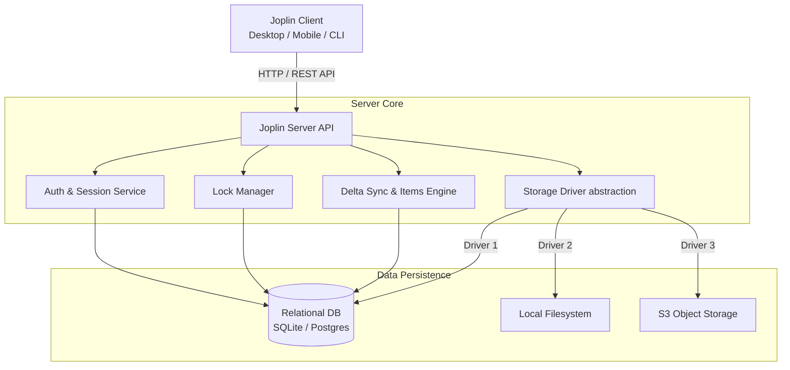

# Deep Dive: Joplin Server Architecture & API Specification

This document provides a comprehensive analysis of the **Joplin Server** architecture, communication protocol, storage engine, and API endpoints, designed as a foundation for building a custom, lightweight Joplin Server implementation.

---

## 1. High-Level System Architecture

Joplin Server functions as a specialized sync target and collaboration server for official Joplin clients (Desktop, Mobile, CLI).



### Key Architectural Concepts

1. **Decoupled Metadata and Content**:
   - **Metadata** (item ID, name, MIME type, Joplin type, modification timestamps, ownership) is always stored in the database.
   - **Content** (note markdown payload, folder properties, attached PDF/image binary blobs) is stored via a **Storage Driver** (Database BLOB, Local Disk, or S3).

2. **Per-User Path Mapping & Virtual Root**:
   - The sync client addresses items relative to a root folder: `api/items/root:/<relative_path>:`.
   - On the server, all item paths are resolved per user (`user_id`). Items are unique by name within a user's account namespace.

3. **Incremental Delta Synchronization (`changes_2`)**:
   - Rather than listing thousands of files or scanning directory trees, sync clients query an auto-incrementing sequential log of changes (`changes_2`).
   - Sync is driven by a pagination cursor representing the last seen change counter.

4. **Built-in Lock Handler**:
   - Concurrency control is performed via native REST API endpoints (`/api/locks`) instead of writing lock files to storage, avoiding lock file pollution and race conditions.

---

## 2. API Endpoints Specification

### Authentication & Session Flow
Joplin Server uses bearer-style token authentication passed in an HTTP header.

- **Header Name**: `X-API-AUTH: <session_id>`
- **Min Version Header**: `X-API-MIN-VERSION: 2.6.0` (sent by clients)

#### 1. Create Session / Login
- **Endpoint**: `POST /api/sessions`
- **Public**: Yes
- **Request Body**:
```json
{
  "email": "user@example.com",
  "password": "user_password",
  "apiKey": "",
  "platform": 1,
  "type": 1,
  "version": "3.0.0"
}
```
- **Response** (`200 OK`):
```json
{
  "id": "32_char_session_token_id",
  "user_id": "32_char_user_uuid"
}
```
- **Behavior**: Validates credentials. On success, creates a row in the `sessions` table and returns the session ID. Subsequent requests supply `X-API-AUTH: 32_char_session_token_id`. If an API call returns `403 Forbidden`, the Joplin client automatically invalidates its cached session and re-authenticates via `POST /api/sessions`.

---

### Sync & Item Operations (`/api/items`)

Path Encoding Rule: `api/items/root:/<path>:<suffix>`
- Root item metadata: `GET api/items/root::`
- Item file content: `GET api/items/root:/notes/123.md:/content`

#### 2. Get Item Metadata (Stat)
- **Endpoint**: `GET /api/items/root:/<path>:`
- **Response** (`200 OK`):
```json
{
  "id": "32_char_item_uuid",
  "name": "1234567890abcdef.md",
  "mime_type": "text/plain",
  "updated_time": 1700000000000,
  "jop_updated_time": 1700000000000,
  "jopItem": {}
}
```
- **Error**: `404 Not Found` if item does not exist.

#### 3. Fetch Item Content
- **Endpoint**: `GET /api/items/root:/<path>:/content`
- **Response**: Returns raw note UTF-8 string or binary octet-stream.

#### 4. Upload / Create / Update Single Item Content
- **Endpoint**: `PUT /api/items/root:/<path>:/content`
- **Headers**: `Content-Type: application/octet-stream`
- **Query Params**: `?share_id=<share_id>` (optional)
- **Body**: Raw string or binary payload.
- **Response** (`200 OK`): Returns JSON item metadata.

#### 5. Delete Single Item
- **Endpoint**: `DELETE /api/items/root:/<path>:`
- **Response** (`200 OK`): Empty success response.

#### 6. Fetch Incremental Changes (Delta Sync)
- **Endpoint**: `GET /api/items/root:/<path>:/delta`
- **Query Params**: `?cursor=<cursor_string>` (optional)
- **Response** (`200 OK`):
```json
{
  "items": [
    {
      "item_name": "123456.md",
      "type": 1,
      "updated_time": 1700000000000,
      "jop_updated_time": 1700000000000
    },
    {
      "item_name": "deleted_note.md",
      "type": 3,
      "updated_time": 1700000000000
    }
  ],
  "has_more": false,
  "cursor": "next_cursor_id"
}
```
- *Note*: `type === 3` indicates a deleted item.

#### 7. Directory Children Listing (Fallback/List)
- **Endpoint**: `GET /api/items/root:/<path>/*:/children`
- **Query Params**: `?cursor=<cursor_string>`
- **Response** (`200 OK`):
```json
{
  "items": [ ... ],
  "has_more": false,
  "cursor": "next_cursor_id"
}
```

---

### Batch Operations (`/api/batch_items`)

Used when `supportsMultiPut` or `supportsMultiDelete` is active to optimize network latency.

#### 8. Batch Upload Items
- **Endpoint**: `PUT /api/batch_items`
- **Request Body**:
```json
{
  "items": [
    { "name": "note1.md", "body": "raw_content_1" },
    { "name": "note2.md", "body": "raw_content_2" }
  ]
}
```
- **Response** (`200 OK`):
```json
{
  "items": {
    "note1.md": { "item": { "id": "..." }, "error": null },
    "note2.md": { "item": { "id": "..." }, "error": null }
  },
  "has_more": false
}
```

#### 9. Batch Delete Items
- **Endpoint**: `DELETE /api/batch_items`
- **Request Body**:
```json
{
  "items": [ "note1.md", "note2.md" ]
}
```
- **Response** (`200 OK`):
```json
{
  "items": {
    "note1.md": {},
    "note2.md": {}
  },
  "has_more": false
}
```

---

### Concurrency Lock Management (`/api/locks`)

#### 10. Acquire Lock
- **Endpoint**: `POST /api/locks`
- **Request Body**:
```json
{
  "type": 1,
  "clientType": 1,
  "clientId": "client_device_uuid_123"
}
```
*Lock Types*: `1` = Sync Lock, `2` = Exclusive Lock.  
*Client Types*: `1` = Desktop, `2` = Mobile, `3` = CLI.

- **Response** (`200 OK`): Lock record object.

#### 11. Release Lock
- **Endpoint**: `DELETE /api/locks/:type_:clientType_:clientId`
- **Example Path**: `DELETE /api/locks/1_1_client_device_uuid_123`
- **Response** (`200 OK`): Success.

#### 12. List Active Locks
- **Endpoint**: `GET /api/locks`
- **Response** (`200 OK`): `{ "items": [ ... ], "has_more": false }`

---

## 3. Data Storage & Schema Design

### Database Table Classification

Joplin Server contains **24 tables**. For a custom sync server implementation, these can be split into **Essential Sync Tables** vs **Optional/Extraneous Features**.

```
Joplin Server Tables (24)
├── ESSENTIAL FOR SYNC (7)
│   ├── users             (User authentication & credentials)
│   ├── sessions          (API session tokens)
│   ├── items             (Item metadata & BLOB content)
│   ├── user_items        (User-to-Item mapping)
│   ├── changes_2         (Delta sync change event log)
│   ├── storages          (Storage driver registry)
│   └── key_values        (KeyValue store & locks tracking)
│
└── OPTIONAL / EXTRA FEATURES (17)
    ├── Sharing           (shares, share_users, item_resources)
    ├── Auth Extras       (applications, recovery_codes, tokens, api_clients)
    ├── System & Admin    (events, task_states, notifications, emails, user_deletions, backup_items, files)
    └── Billing/Cloud     (subscriptions, user_flags, stripe_events)
```

---

### Minimal SQL Schema for Custom Server

Here is the complete, minimal SQL schema required to power official Joplin clients in SQLite / Postgres:

```sql
-- 1. User Accounts
CREATE TABLE users (
    id VARCHAR(32) PRIMARY KEY,
    email TEXT UNIQUE NOT NULL,
    password TEXT NOT NULL,
    full_name TEXT DEFAULT '' NOT NULL,
    is_admin INTEGER DEFAULT 0 NOT NULL,
    created_time BIGINT NOT NULL,
    updated_time BIGINT NOT NULL
);

-- 2. Sessions (API authentication tokens)
CREATE TABLE sessions (
    id VARCHAR(32) PRIMARY KEY,
    user_id VARCHAR(32) NOT NULL,
    auth_code VARCHAR(32) DEFAULT '' NOT NULL,
    created_time BIGINT NOT NULL,
    updated_time BIGINT NOT NULL,
    FOREIGN KEY(user_id) REFERENCES users(id)
);

-- 3. Storage Driver Registry
CREATE TABLE storages (
    id INTEGER PRIMARY KEY AUTOINCREMENT,
    connection_string TEXT UNIQUE NOT NULL,
    created_time BIGINT NOT NULL,
    updated_time BIGINT NOT NULL
);

-- 4. Item Metadata and Content
CREATE TABLE items (
    id VARCHAR(32) PRIMARY KEY,
    name TEXT NOT NULL,
    mime_type VARCHAR(128) DEFAULT 'application/octet-stream' NOT NULL,
    content BLOB DEFAULT '' NOT NULL,
    content_size INTEGER DEFAULT 0 NOT NULL,
    jop_id VARCHAR(32) DEFAULT '' NOT NULL,
    jop_parent_id VARCHAR(32) DEFAULT '' NOT NULL,
    jop_share_id VARCHAR(32) DEFAULT '' NOT NULL,
    jop_type INTEGER DEFAULT 0 NOT NULL,
    jop_encryption_applied INTEGER DEFAULT 0 NOT NULL,
    jop_updated_time BIGINT DEFAULT 0 NOT NULL,
    owner_id VARCHAR(32) NOT NULL,
    content_storage_id INTEGER DEFAULT 1 NOT NULL,
    created_time BIGINT NOT NULL,
    updated_time BIGINT NOT NULL
);
CREATE INDEX idx_items_jop_id ON items(jop_id);
CREATE INDEX idx_items_name ON items(name);

-- 5. User-Item Ownership Mapping
CREATE TABLE user_items (
    id INTEGER PRIMARY KEY AUTOINCREMENT,
    user_id VARCHAR(32) NOT NULL,
    item_id VARCHAR(32) NOT NULL,
    created_time BIGINT NOT NULL,
    updated_time BIGINT NOT NULL,
    UNIQUE(user_id, item_id)
);
CREATE INDEX idx_user_items_user_id ON user_items(user_id);
CREATE INDEX idx_user_items_item_id ON user_items(item_id);

-- 6. Delta Sync Log
CREATE TABLE changes_2 (
    counter BIGINT PRIMARY KEY AUTOINCREMENT,
    id VARCHAR(32) UNIQUE NOT NULL,
    item_id VARCHAR(32) NOT NULL,
    user_id VARCHAR(32) DEFAULT '' NOT NULL,
    item_name TEXT DEFAULT '' NOT NULL,
    previous_share_id VARCHAR(32) DEFAULT '' NOT NULL,
    item_type INTEGER NOT NULL,
    type INTEGER NOT NULL,
    created_time BIGINT NOT NULL,
    updated_time BIGINT NOT NULL,
    UNIQUE(user_id, counter)
);
CREATE INDEX idx_changes2_item_id ON changes_2(item_id);

-- 7. Key-Value & Lock Storage
CREATE TABLE key_values (
    id INTEGER PRIMARY KEY AUTOINCREMENT,
    key TEXT UNIQUE NOT NULL,
    type INTEGER NOT NULL,
    value TEXT NOT NULL
);
CREATE INDEX idx_key_values_key ON key_values(key);
```

---

## 4. Summary Matrix: Bare Minimum vs Full Joplin Server

| Feature Area | Full Joplin Server | Bare Minimum Custom Implementation |
| :--- | :--- | :--- |
| **Authentication** | Passwords, SAML SSO, MFA, Recovery Codes, Application Tokens | Password Hash + Session Tokens |
| **Storage Backend** | Modular (Database, Filesystem, AWS S3) | Single Driver (Filesystem or SQLite BLOB) |
| **Sync Protocol** | `/api/items/...` + `/api/batch_items` | `/api/items/...` (batch optional but recommended) |
| **Delta Engine** | Multi-recipient change compression (`changes_2`) | Single-user sequential `changes_2` table |
| **Lock Engine** | Native `/api/locks` endpoints | Native `/api/locks` backed by simple KV/Memory |
| **Web Management UI** | Complete Admin & Profile Dashboard | None (or simple REST API/CLI user seed script) |
| **Collaboration** | Note & Folder Sharing, Master Keys | Omitted |
| **Background Tasks** | 16 cron tasks (compression, orphan cleanup, etc.) | Optional periodic `changes_2` cleanup |
| **Database Schema** | 24 Tables | **7 Tables** |

---

## 5. Next Steps for Implementation

When planning your custom server implementation (in Go, Rust, Node.js, Python, or Elixir):

1. **Step 1: Auth & Session Management**
   - Implement `POST /api/sessions` and request middleware to check `X-API-AUTH` header against active sessions.
2. **Step 2: Key-Value & Locks**
   - Implement `POST /api/locks`, `DELETE /api/locks/:id`, and `GET /api/locks`.
3. **Step 3: Item CRUD & Change Tracking**
   - Implement `PUT /api/items/root:/<path>:/content` to write files and insert a `ChangeType.Create` or `ChangeType.Update` entry into `changes_2`.
   - Implement `DELETE /api/items/root:/<path>:` to mark/delete items and insert a `ChangeType.Delete` entry into `changes_2`.
4. **Step 4: Delta Sync Protocol**
   - Implement `GET /api/items/root:/<path>:/delta?cursor=<cursor>` querying `changes_2 WHERE counter > :cursor_counter ORDER BY counter ASC`.
5. **Step 5: Client Verification**
   - Test with official Joplin Desktop / Mobile app using the "Joplin Server" sync target.
